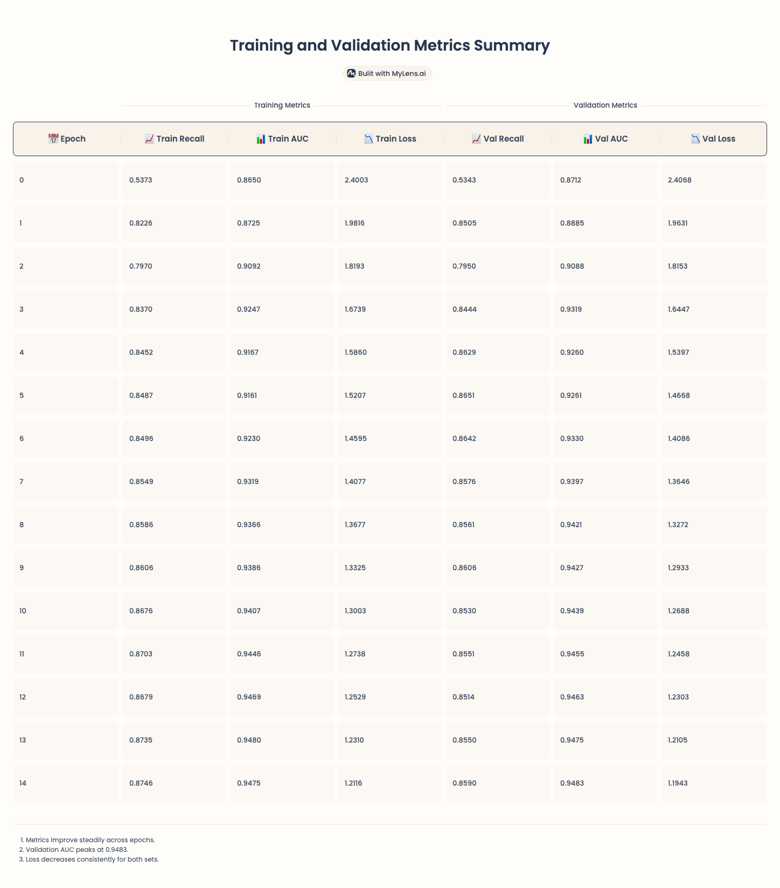

# Path and Cost Based GNN Model

A PyTorch implementation for the paper below:  
**Path and Cost Based GNN Model for Imbalanced Learning for Mobile Social Network Fraud Detection**

## Running CSGNN

To run the code, you need to have at least Python 3.7 or later versions.  
1.Run `python data_process.py` to generate Sichuan and BUPT dataset in DGL;  
2.-Run `python main.py --config ./config/csgnn_sichuan.yml` to run CSGNN with default settings on Sihcuan dataset.
-Run `python main.py --config ./config/csgnn_bupt.yml` to run CSGNN with default settings on BUPT dataset.   

## Repo Structure
The repository is organized as follows:
- `data_process.py`: convert raw node features and adjacency matrix to DGL dataset;
- `main.py`:  training and testing CSGNN;
- `model.py`: CSGNN model implementations;
- `utils.py`: utility functions.  

# Model Train Report

